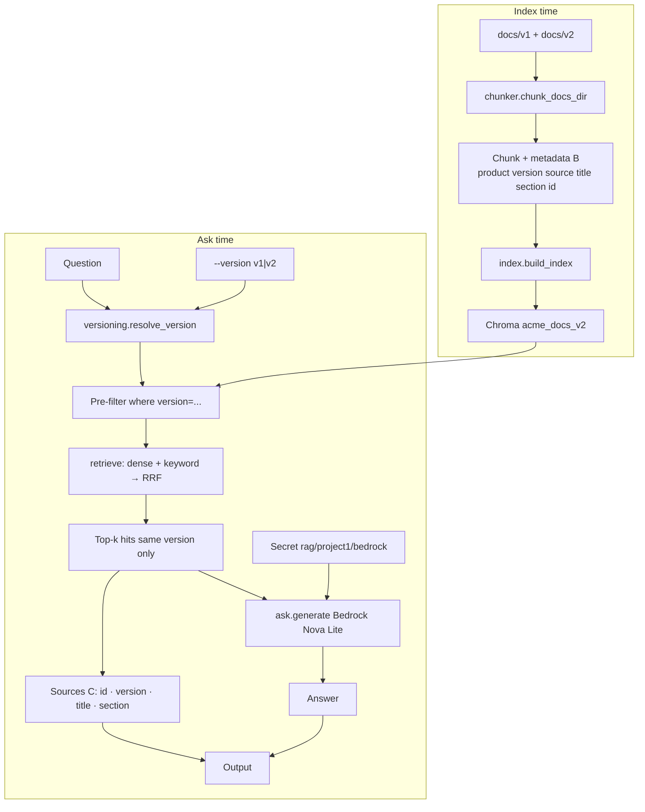

# Project 2 — Flow

```mermaid
flowchart TB
  subgraph ingest [Index time]
    docs["docs/v1 + docs/v2"] --> chunker["chunker.chunk_docs_dir"]
    chunker --> meta["Chunk + metadata B<br/>product version source title section id"]
    meta --> indexBuild["index.build_index"]
    indexBuild --> chroma["Chroma acme_docs_v2"]
  end

  subgraph askPath [Ask time]
    q["Question"] --> resolve["versioning.resolve_version"]
    explicit["--version v1|v2"] --> resolve
    resolve --> filter["Pre-filter where version=..."]
    chroma --> filter
    filter --> hybrid["retrieve: dense + keyword → RRF"]
    hybrid --> hits["Top-k hits same version only"]
    hits --> gen["ask.generate Bedrock Nova Lite"]
    secret["Secret rag/project1/bedrock"] --> gen
    gen --> answer["Answer"]
    hits --> sources["Sources C: id · version · title · section"]
    answer --> out["Output"]
    sources --> out
  end
```
