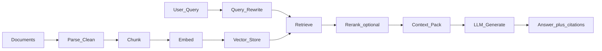
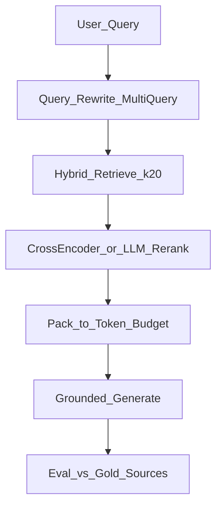

# Today's RAG Learning Plan (Architecture-First)

**Default assumptions:** ~3–4 hours today; domain = product/docs knowledge base (most transferable). If you only have ~2 hours, stop after Project 2. If you have 5–6+, finish Project 4 and the design drill.

**How sessions work:** You design (data flow, chunking, retrieval, eval). Agents/I implement. After each project you articulate *why* each choice was made and what breaks if you change it.

---

## Phase 0 — Mental model (20–25 min, no code)

Goal: name every stage of a RAG pipeline and know what each stage optimizes for.

**You must be able to explain in one sentence each:**

| Stage | Design question |
|-------|-----------------|
| Ingest / parse | What format noise must die before indexing? |
| Chunking | What is a "useful answer unit"? Overlap? |
| Embeddings | Same model for query + docs? Domain mismatch? |
| Index | Metadata filters? Hybrid (BM25 + vector)? |
| Retrieval | Top-k, similarity threshold, multi-query? |
| Context packing | Token budget, ordering, dedupe, citations |
| Generation | Grounding prompts, "I don't know", refusal |
| Eval | Did we retrieve the right stuff? Did the answer stay faithful? |

**Failure modes to memorize (these drive all later design choices):**

- Wrong chunk size → retrieve noise or miss the answer span
- Bad metadata → can't filter by product/version/date
- Pure vector search fails on exact IDs, error codes, rare terms → need hybrid
- Too much context → model ignores the useful paragraph
- No citations / faithfulness check → fluent hallucination

**Exit check:** Draw the pipeline from memory and point to where you'd debug "answers are vague but sound confident."

---

## Project 1 — Naive RAG: "Docs Q&A" (40–50 min)

**System:** Upload a small doc set (README + 2–3 markdown pages). Ask questions. Get answers with source snippets.

**Architecture you design (before any code):**

1. Chunk strategy: fixed size vs paragraph/heading-aware (pick one; justify)
2. Embedding + store (e.g. local Chroma / similar — keep infra dumb)
3. Retrieve top-k → stuff into prompt → generate
4. Always return: answer + cited chunk IDs

**What you learn:** The canonical loop. Why "RAG" is just *retrieve then condition generation*.

**Design drill after build:** Change chunk size (e.g. 200 vs 800 tokens). Predict what breaks. Observe. Write one lesson: "For this corpus, X worked because…"

**Exit check:** You can sketch this pipeline and name 3 knobs (chunk size, k, prompt grounding) and their effects.

---

## Project 2 — Production-shaped Naive+: metadata + hybrid (45–55 min)

**System:** Same docs Q&A, but now documents have `product`, `version`, `section`. Queries like "In v2, how do I reset API keys?"

**Architecture upgrades you design:**

1. **Metadata schema** on every chunk (source path, title, version, section)
2. **Filtered retrieval** (version = v2) before or with vector search
3. **Hybrid retrieval:** BM25/keyword + dense vectors, simple fusion (e.g. RRF)
4. **Citation contract:** every claim maps to a chunk; UI or response shows sources

**What you learn:** Real RAG fails on exact strings and version confusion; metadata + hybrid fix the two most common production bugs.

**Design drill:** Invent a query that pure vector search would miss (error code, exact config key). Confirm hybrid finds it.

**Exit check:** Explain when to use filters vs hybrid vs just increasing k.

---

## Project 3 — Advanced pipeline: rewrite → retrieve → rerank → pack (50–60 min)

**System:** Multi-hop / vague questions ("Why does billing fail after upgrade?") that need better query handling and tighter context.

**Architecture you design:**

1. **Query rewrite / multi-query:** expand vague questions into 2–3 search queries
2. **Retrieve more, rerank fewer:** fetch k=20–50, rerank to top 5–8
3. **Context packing:** score-ordered, dedupe overlapping chunks, hard token budget
4. **Grounded generation:** system prompt that forbids inventing; cite or say unknown
5. **Lightweight eval set:** 8–10 questions with expected source docs (not just "looks good")

**What you learn:** Advanced RAG is mostly *query understanding + ranking + budget*, not a fancier vector DB.

**Design drill:** For one failing question, say whether the bug is rewrite, retrieval, rerank, packing, or generation — then change only that stage.

**Exit check:** You can diagnose "wrong answer" into the correct stage without guessing.

---

## Project 4 — Architecture stretch: agentic / multi-corpus RAG (45–60 min, if time)

**System:** Two corpora (e.g. product docs + support tickets). Router decides which index(es) to query; optional tool loop: retrieve → read → retrieve again.

**Architecture you design:**

1. **Corpus router:** rules or small classifier (docs vs tickets vs both)
2. **Per-corpus indexes** with different chunking (docs: headings; tickets: whole thread summaries)
3. **Agentic loop (bounded):** max 2 retrieval rounds; stop when enough evidence
4. **Answer synthesis** across sources with conflict policy ("docs win over tickets for how-to")

**What you learn:** Advanced systems are *routing + policies + bounds*, not infinite agent loops.

**Skip if short on time** — Project 3 already gets you to "can design solid pipelines."

---

## End-of-day artifact (15 min) — Your RAG design checklist

You leave with a one-page checklist you reuse whenever agents build for you:

1. What is the unit of truth? (chunk definition)
2. What metadata enables filters?
3. Dense only, or hybrid? Why?
4. Query transform? Rerank? Token budget?
5. Citation + "I don't know" policy
6. How do we know it works? (gold Q/source pairs, faithfulness)
7. Failure mode for this domain (IDs, versions, multi-hop, conflicts)

**Success criteria for today:** Given a new use case ("internal HR policy bot", "codebase assistant"), you can design the pipeline on a whiteboard in ~10 minutes and hand agents a clear build brief — without writing the code yourself.

---

## Session rhythm (recommended)

| Block | Time | Focus |
|-------|------|--------|
| Phase 0 | 25 min | Overview + failure modes |
| Project 1 | 45 min | Naive RAG |
| Project 2 | 50 min | Metadata + hybrid |
| Break | 10 min | — |
| Project 3 | 55 min | Rewrite / rerank / eval |
| Project 4 or checklist | 45 min | Agentic stretch *or* solidify checklist |

**Your job each project:** write a short design brief (inputs, stages, knobs, success metrics) → agents implement → you review against the brief → one design lesson logged.

**Out of scope today:** fine-tuning embedders, graph RAG deep-dives, production infra (K8s, auth), fancy UI. Those are day-2+ topics once the pipeline judgment is solid.
